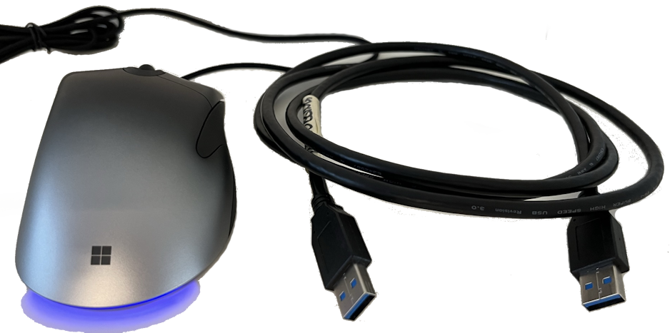

Filter drivers for Microsoft Pro IntelliMouse that implements safety checks and exposes WMI interfaces. Based on the KMDF HID device [firefly](https://github.com/microsoft/Windows-driver-samples/tree/main/hid/firefly) sample from Microsoft that have been updated to work with more recent IntelliMouse models ([backport request](https://github.com/microsoft/Windows-driver-samples/issues/1022)). The mouse should report itself with `VendorID=045E` (Microsoft) and `ProductID=082A` (Pro IntelliMouse).

### Driver projects

<table>
    <thead>
        <tr>
            <th>Driver</th>
            <th>Description</th>
            <th>Test utilities</th>
        </tr>
    </thead>
    <tbody>
        <tr>
            <td><b>MouseMirror</b></td>
            <td>An upper device filter driver for the Mouse class for Microsoft Pro Intellimouse. Registers a <a href="MouseMirror/MouseMirror.mof">MouseMirrorDeviceInformation</a> WMI class that can be accessed from user mode to mirror mouse movement. Can easily be modified to also work with other mouse models.</td>
            <td><tt>MouseMirror.ps1</tt>: PowerShell script for enabling mirroring of mouse movement through the WMI interface.</td>
        </tr>
        <tr>
            <td rowspan=3><b>TailLight</b></td>
            <td rowspan=3>An upper device filter driver for the HID class for Microsoft Pro Intellimouse. Registers a <a href="TailLight/TailLight.mof">TailLightDeviceInformation</a> WMI class that can be accessed from user mode to control the tail-light.</td>
            <td><tt>TailLight.ps1</tt>: PowerShell script for updating the tail-light through the WMI interface.</td>
        </tr>
        <tr>
            <!-- <td></td> -->
            <!-- <td></td> -->
            <td><tt>HidUtil</tt>: Command-line utility for querying and communicating with HID devices.</td>
        </tr>
        <tr>
            <!-- <td></td> -->
            <!-- <td></td> -->
            <td><tt>flicker</tt>: Application for causing the mouse to blink by sending commands through the WMI interface.</td>
        </tr>
        <tr>
            <td><b>VirtualMouse</b></td>
            <td><a href="https://learn.microsoft.com/en-us/windows-hardware/drivers/usbcon/developing-windows-drivers-for-emulated-usb-host-controllers-and-devices">UDE</a> driver for emulating a USB mouse. Based on <a href="https://github.com/xxandy/USB_UDE_Sample">xxandy/USB_UDE_Sample</a></td>
            <td><tt>MouseMove</tt>: Command-line utility for moving the mouse cursor. Does unfortunately <i>not</i> work in a VM.</td>
        </tr>
    </tbody>
</table>

### Prerequisites
* Optional: Microsoft [Pro IntelliMouse](https://www.microsoft.com/en/accessories/products/mice/microsoft-pro-intellimouse) for testing of the `TailLight` driver.
* Separate computer or VirtualBox VM for driver testing. Needed to avoid crashing or corrupting your main computer in case of driver problems.

**Getting started information for [driver testing](../../wiki/Driver-testing)**.

  
