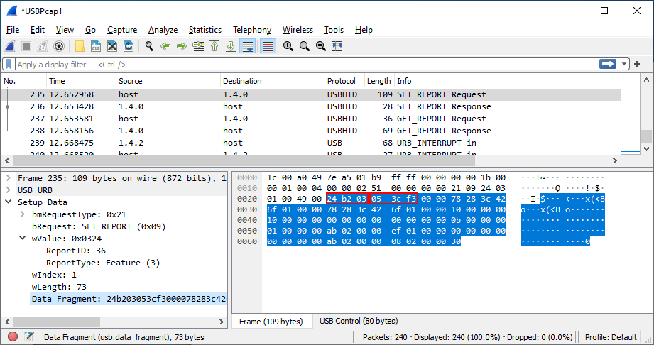
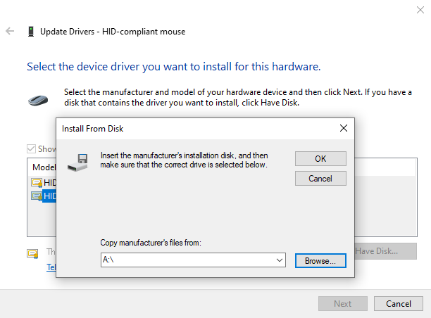
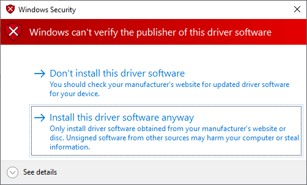

Microsoft IntelliMouse utilities. Tested on [Pro IntelliMouse](https://www.microsoft.com/en/accessories/products/mice/microsoft-pro-intellimouse) Shadow with `VendorID=045E` (Microsoft) and `ProductID=082A` (Pro IntelliMouse).

Tools:
* `TailLight.exe`: Command-line utility for changing the tail-light color.

### Tail-light protocol
Steps to update the tail-light:
* Connect to mouse HID device with `Usage=0212` and `UsagePage=FF07`.
* Send a *feature report* with the following header:
```
FeatureReport[0] = 0x24; // ReportID 36
FeatureReport[1] = 0xB2; // magic value
FeatureReport[2] = 0x03; // magic value
FeatureReport[3] = red;
FeatureReport[4] = green;
FeatureReport[5] = blue;
```

### How to reverse-engineer the protocol
It's possible to reverse-engineer the IntelliMouse USB HID protocol by installing [USBPcap](https://desowin.org/usbpcap/) and [Wireshark](https://www.wireshark.org/).

Steps:
1. Open Wireshark with USBPcap plugin.
2. Open "Microsoft Mouse and Keyboard Center" app.
3. Change tail-light color.
4. Observe `USBHID` `SET_REPORT Request` packages with `ReportID=36` and `ReportType=Feature` that adhere to the format described above. 



The feature report also contains a number of other non-zero bytes. I don't know if they carry a meaning or are just uninitialized memory.

## Driver development
Relevant resources for getting started with driver development against IntelliMouse:
* [Windows Driver Kit (WDK)](https://learn.microsoft.com/en-us/windows-hardware/drivers/download-the-wdk) installation.
* PnP [Device Tree](https://learn.microsoft.com/en-us/windows-hardware/drivers/kernel/device-tree)
* [KMDF filter driver for a HID device](https://github.com/microsoft/windows-driver-samples/tree/main/hid/firefly) sample.
* [HIDClass Hardware IDs for Top-Level Collections](https://learn.microsoft.com/en-us/windows-hardware/drivers/hid/hidclass-hardware-ids-for-top-level-collections) documents the `HID\Vid_v(4)&Pid_d(4)&MI_z(2)&Colb(2)` identifier.

### Target computer configuration
Steps to configure the *target* computer for driver testing:
* Disable Secure Boot in UEFI/BIOS.
* Enable test-signed drivers: [`bcdedit /set testsigning on`](https://learn.microsoft.com/en-us/windows-hardware/drivers/install/the-testsigning-boot-configuration-option).
* Configuration of [kernel-mode debugging over a USB 3.0 cable](https://learn.microsoft.com/en-us/windows-hardware/drivers/debugger/setting-up-a-usb-3-0-debug-cable-connection) with a USB 3 A/A crossover cable:
  - `bcdedit /debug on`
  - `bcdedit /dbgsettings usb targetname:KernelUSBConn`
  - `bcdedit /set "{dbgsettings}" busparams <b.d.f>` (bus, device & function numbers for USB host controller)
* From the host computer, connect with the WinDbg over USB to the `KernelUSBConn` target.
* Restart the target computer.
* WinDbg configuration to enable debug messages: `kd>ed nt!Kd_DEFAULT_Mask 0xff`.

### Command-line driver installation
Install: `PNPUTIL /add-driver <oem#.inf> /install`

Uninstall: `PNPUTIL /delete-driver <oem#.inf> /uninstall`

### Manual driver installation
* Open "Device Manager"
* Right-click on the relevant device, and select "Update driver".
* Click on "Browse my computer for drivers".
* Click on "Let me pick from a list...".
* Click on "Have Disk..." and select the driver in the file system:

* Click on "Install this driver software anyway" when being warned about the publisher:

