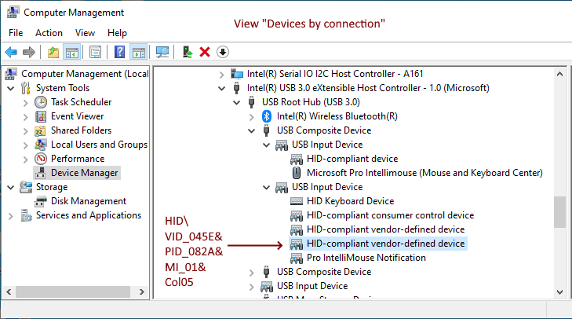

Microsoft IntelliMouse utilities. Tested on [Pro IntelliMouse](https://www.microsoft.com/en/accessories/products/mice/microsoft-pro-intellimouse) Shadow with `VendorID=045E` (Microsoft) and `ProductID=082A` (Pro IntelliMouse).

Tools:
* `TailLight.exe`: Command-line utility for changing the tail-light color.

### Tail-light protocol
Steps to update the tail-light:
* Connect to mouse HID device with `Usage=0212` and `UsagePage=FF07`.
* Send a *feature report* with the following header:
```
FeatureReport[0] = 0x24; // ReportID 36
FeatureReport[1] = 0xB2; // magic value
FeatureReport[2] = 0x03; // magic value
FeatureReport[3] = red;
FeatureReport[4] = green;
FeatureReport[5] = blue;
```

### How to reverse-engineer the protocol
It's possible to reverse-engineer the IntelliMouse USB HID protocol by installing [USBPcap](https://desowin.org/usbpcap/) and [Wireshark](https://www.wireshark.org/).

Steps:
1. Open Wireshark with USBPcap plugin.
2. Open "Microsoft Mouse and Keyboard Center" app.
3. Change tail-light color.
4. Observe `USBHID` `SET_REPORT Request` packages with `ReportID=36` and `ReportType=Feature` that adhere to the format described above. 


The feature report also contains a number of other non-zero bytes. I don't know if they carry a meaning or are just uninitialized memory.

## Driver development
The Firefly sample is installed as an upper filter driver for Microsoft Pro Intellimouse. An application provided with the sample can cause the light of the optical mouse to blink by sending commands to the filter driver using the WMI interface.


The sample consists of:
* `firefly.sys` driver: An upper device filter driver for the HID class. Based on the [KMDF filter driver for a HID device](https://github.com/microsoft/Windows-driver-samples/tree/main/hid/firefly) sample from Microsoft. During start device, the driver registers a WMI class (FireflyDeviceInformation). The user mode application connects to the WMI namespace (root\\wmi) and opens this class using COM interfaces. Then the application can make requests to read ("get") or change ("set") the current value of the TailLit data value from this class. In response to a set WMI request, the driver opens the HID collection using IoTarget and sends [**IOCTL\_HID\_GET\_COLLECTION\_INFORMATION**](https://docs.microsoft.com/windows-hardware/drivers/ddi/content/hidclass/ni-hidclass-ioctl_hid_get_collection_information) and [**IOCTL\_HID\_GET\_COLLECTION\_DESCRIPTOR**](https://docs.microsoft.com/windows-hardware/drivers/ddi/content/hidclass/ni-hidclass-ioctl_hid_get_collection_descriptor) requests to get the preparsed data. The driver then calls [**HidP\_GetCaps**](https://docs.microsoft.com/windows-hardware/drivers/ddi/content/hidpi/nf-hidpi-hidp_getcaps) using the preparsed data to retrieve the capabilities of the device. After getting the capabilities of the device, the driver creates a feature report to set or clear the feature that causes the light to toggle.
* `flicker.exe` application: The application opens the WMI interfaces and send set requests to toggle the light.

Relevant documentation:
* [Windows Driver Kit (WDK)](https://learn.microsoft.com/en-us/windows-hardware/drivers/download-the-wdk) installation.
* PnP [Device Tree](https://learn.microsoft.com/en-us/windows-hardware/drivers/kernel/device-tree)
* [HIDClass Hardware IDs for Top-Level Collections](https://learn.microsoft.com/en-us/windows-hardware/drivers/hid/hidclass-hardware-ids-for-top-level-collections) documents the `HID\Vid_v(4)&Pid_d(4)&MI_z(2)&Colb(2)` identifier.

### Target computer configuration
Steps to configure the *target* computer for driver testing:
* Disable Secure Boot in UEFI/BIOS.
* Enable test-signed drivers: [`bcdedit /set testsigning on`](https://learn.microsoft.com/en-us/windows-hardware/drivers/install/the-testsigning-boot-configuration-option).
* Configuration of [kernel-mode debugging over a USB 3.0 cable](https://learn.microsoft.com/en-us/windows-hardware/drivers/debugger/setting-up-a-usb-3-0-debug-cable-connection) with a USB 3 A/A crossover cable:
  - `bcdedit /debug on`
  - `bcdedit /dbgsettings usb targetname:KernelUSBConn`
  - `bcdedit /set "{dbgsettings}" busparams <b.d.f>` (bus, device & function numbers for USB host controller)
* From the host computer, connect with the WinDbg over USB to the `KernelUSBConn` target.
* Restart the target computer.
* WinDbg configuration to enable debug messages: `kd>ed nt!Kd_DEFAULT_Mask 0xff`.

### Driver testing
Driver installation:
* Open "Device Manager".
* Switch to "Devices by connection" view.
* Navigate to the "HID-compliant vendor-defined device" with `HID\VID_045E&PID_082A&MI_01&Col05` hardware ID.

* Right-click on the relevant device, and select "Update driver".
* Click on "Browse my computer for drivers".
* Click on "Let me pick from a list...".
* Click on "Have Disk..." and select `firefly.inf` in the file system:

* Click on "Install this driver software anyway" when being warned about the publisher:


Driver uninstallation:
* Either uninstall the driver from "Device Manager",
* or run `PNPUTIL /delete-driver firefly.inf /uninstall` from an admin command-prompt.
